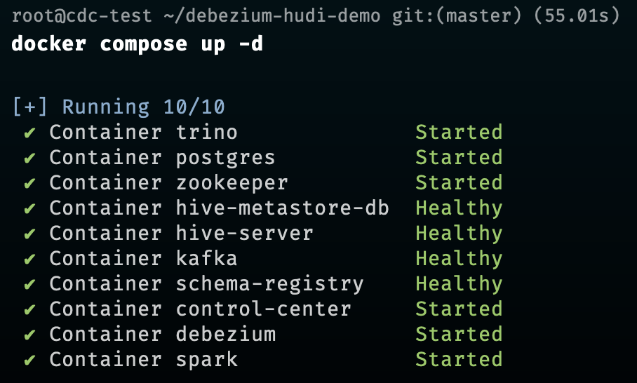

## Debezium (Kafka Connect) with Apache Hudi for CDC (Change Data Capture)

This project is a simple demo to show how to use Debezium (Kafka Connect) with Apache Hudi for CDC (Change Data Capture) in a postgres database using docker-compose.

### Considerations

- This integration uses `Google Storage` as the storage backend for Hive Metastore.
- Used latest stable version of `Trino` which is 433.
- Used hive metastore version `2.3.1` and corresponding supported version of Hadoop `2.10.1`
- Used debezium version `2.4` and confluent version `7.0.1`

### Acknowledgements

- Change Data Capture with Debezium and Apache Hudi. [Hudi Blog](https://hudi.apache.org/blog/2022/01/14/change-data-capture-with-debezium-and-apache-hudi/)
- Kafka deployment with docker compose - [Github](https://github.com/confluentinc/cp-demo/blob/7.5.1-post/docker-compose.yml)
- Debezium Avro Serialization with Confluent schema registry - [Debezium Docs](https://debezium.io/documentation/reference/stable/configuration/avro.html)
- Debezium image support for Confluent schema registry - [Article Link](https://dev.to/lazypro/making-debezium-2x-support-confluent-schema-registry-3mf2)

---

### Running the project locally

#### Prerequisites

- Please use `amd64` architecture for running this project. Encountered some issues with M1 Mac (arm64 architecture) as `zookeeper` and `kafka` images are not available for `arm64`, the version used in this project.

- Make sure you have a service account with access to a GCS bucket.

```xml
<!-- hive/core-site.xml -->

<property>
        <name>fs.gs.project.id</name>
        <value>{{YOUR GCP PROJECT}}</value>
</property>
```

- Put your service account JSON file as `gcp-sa.json` in `secrets` directory.
- Working directory should be as follows:

```txt
.
├── debezium
│   └── Dockerfile
├── docker-compose.yml
├── hive
│   ├── Dockerfile
│   ├── core-site.xml
│   ├── docker-entrypoint.sh
│   └── hive-site.xml
├── scripts
│   ├── add-debezium-connector.sh
│   └── spark-submit.sh
├── secrets
│   └── gcp-sa.json
├── spark
│   └── Dockerfile
└── trino
    ├── hudi.properties
    └── pg.properties
```

#### Running the services

```bash
docker-compose up -d
```



#### Insert data into OLTP database (postgres) through Trino

```bash
trino --server http://localhost:8080 --catalog pg --schema public
```

```sql
CREATE TABLE tpcds_customer AS
(
  SELECT * FROM tpcds.sf1.customer
  WHERE
    c_birth_country='NEW ZEALAND'
  LIMIT 10
);
```

```sql
INSERT INTO pg.public.tpcds_customer
(
  SELECT * FROM tpcds.sf1.customer
  WHERE
    c_birth_country='HUNGARY'
  LIMIT 10
);
```

#### Add postgres connector to debezium

```bash
./scripts/add-debezium-connector.sh
```

#### Submit spark job to write data to Hudi

```bash
docker exec -it spark /opt/hudi/spark/runner/spark-submit.sh
```

Monitor spark job status at `http://localhost:4040`

#### Query Hudi table using Trino

```bash
trino --server http://localhost:8080 --catalog hudi --schema hudi
```

```sql
SELECT COUNT(*), c_birth_country
FROM hudi.hudi.tpcds_customer
GROUP BY c_birth_country;
```

#### Clean up the services and volumes

```bash
docker-compose down --remove-orphans --volumes
```

---

Made with ❤️ by [nil1729](https://github.com/nil1729)
